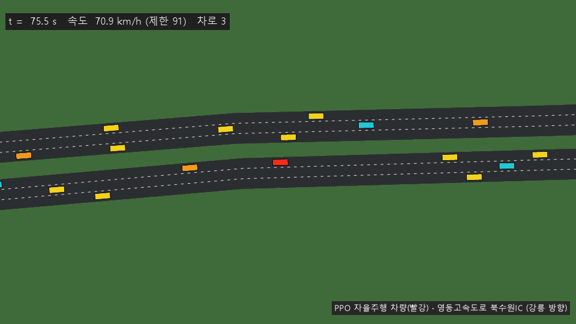
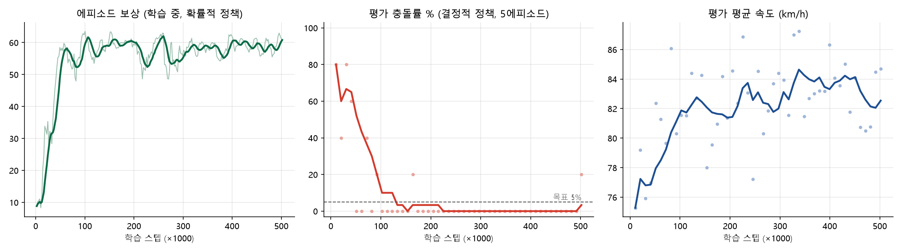

# Team 14 — 영동고속도로 북수원IC 자율주행 프로젝트

> 자율주행 인공지능 및 제어 (ICE3052, 2026-2, 권민혜 교수) 팀 프로젝트
> 수업에서 제공한 원래 README는 [README_course.md](README_course.md)에 있습니다.
> 팀원: 김동주(팀장) · 김수아 · 김준희 · 조윤호
> 최종 발표: **2026-11-28(토) 13:00–19:00, 제1공학관 21동 21502호 (전원 참석 필수)**



## 1. 한 줄 요약

OpenStreetMap에서 가져온 **영동고속도로 북수원IC 일대(강릉 방향, 7.1 km)** 를 SUMO로 구축하고,
그 위에서 **PPO**로 자율주행 차량을 학습해 램프 합류·차로 감소·분기를 통과하게 만들었습니다.
결과 수치는 [§5 결과](#5-결과)에 있습니다.

## 2. 평가 기준 ↔ 우리가 한 것

| 평가 항목 (0_Project_Introduction.md) | 이 프로젝트에서 |
|---|---|
| 도로 구조 구현 (한국 실제 도로 반영) | OSM 원본으로 차로 수·제한속도·램프 형상 재현, 주변 건물/녹지/하천까지 표시 |
| 도로 구조의 복잡성 / 완성도 | 진출 감속차로 → 2차로 램프 합류(5차로) → 차로 감소 5→4→3 → 차로 추가 → 분기, 반대 방향과 램프까지 포함 |
| Simulation 안정성 | 교통류만 5시간 시뮬레이션: 24,000대 투입, 충돌·순간이동 0, 정체 대기 0초 |
| 일반 차량 구성 | Krauss/IDM/EIDM/ACC 4종 혼합 + LC2013 차선변경, 9개 경로, 4,800대/시간 |
| Collision Rate ≤ 5% | `tools/evaluate.py` 100에피소드 평가 (§5) |
| Dataset 구축 | `collect_pomdp_data.py`로 학습된 정책 주행 데이터 수집, HF 데이터셋 카드 준비 |
| Option | 경로 기반 관측(차선 연결성), 구간 제한속도 준수, 경로 이탈 판정, 규칙 기반 기준선 비교, BC(모방학습) 비교, 학습 속도 약 10배 개선 |
| 완성도 | 프로젝트 페이지 `docs/index.html`, 보고서 초안, 발표 자료 초안 |

## 3. 기반 코드에서 바뀐 점

기반 코드: [bmil-ssu/Artificial-Intelligence-and-Control-for-Autonomous-Driving](https://github.com/bmil-ssu/Artificial-Intelligence-and-Control-for-Autonomous-Driving)
(직선 12 km 편도 3차로). 모든 스크립트(`train.py`, `test.py`, `collect_pomdp_data.py`, `train_bc.py`, `view_road.py`)는
그대로 쓸 수 있고, 도로를 바꾸는 곳은 `env/road_config.py` 하나입니다. `ROAD["type"] = "straight"`로 바꾸면 원래 직선 도로로 돌아갑니다.

| 파일 | 변경 |
|---|---|
| `env/osm/*.osm` | 도로(고속도로 본선+램프)와 주변 지형 OSM 원본 |
| `env/road_builder.py` | OSM 모드: `netconvert`로 도로망 생성, (출발, 도착) edge로 경로 자동 계산, 경로별 flow, `polyconvert`로 주변 지형 |
| `env/road_config.py` | 북수원IC 도로, 교통 경로 9개, 컨트롤러별 희망속도 분포·차선변경 성향, warm-up |
| `env/mdp_config.py` | `route_lookahead`(200 m), `speed_reference="lane"`, `privileged_radius`(150 m) |
| `env/sumo_env.py` | ① 경로 기준 차선 연결성(`getBestLanes`) ② 구간 제한속도 준수 ③ 경로 이탈/순간이동 종료 ④ libsumo 자동 사용 ⑤ 에피소드 간 시뮬레이션 재사용 |
| `tools/` | `plot_network.py`(개요도), `evaluate.py`(평가+기준선), `plot_learning_curve.py`, `record_gif.py`, `upload_hf.py` |

### 왜 이렇게 했나 (발표 때 설명할 포인트)
- **경로 기준 연결성:** 원래 관측은 "다음 edge로 링크가 있는가"만 봤습니다. 그런데 진출로로 이어지는 차선도 링크는 있어서,
  "계속 가면 고속도로에서 빠져 버리는 차선"을 구분할 수 없었습니다. SUMO의 `getBestLanes`로 *내 경로를 따라* 그 차선으로 몇 m 더 갈 수 있는지를 관측에 넣었습니다.
- **경로 이탈 = 실패:** 끝나는 차선에 갇히면 실제로는 정지나 사고입니다. 그래서 충돌과 같은 벌점(−5)을 주고 에피소드를 끝냅니다.
- **속도 보상 기준을 구간 제한속도로:** 80 km/h 구간에서 80으로 달려도 만점이 되게 했습니다. 기준을 전체 최고속도(100)로 두면 80 구간에서 늘 손해로 학습됩니다.
- **학습 속도:** 처음에는 41 steps/s였습니다. libsumo(소켓 왕복 제거)로 181 steps/s, 시뮬레이션 재사용(매 에피소드 재시작과 300초 warm-up 제거)으로 약 470 steps/s가 됐습니다.

## 4. 실행 방법

```bash
pip install -r requirements.txt
pip install libsumo==1.27.1          # 선택. 설치된 SUMO 버전과 같아야 함
python view_road.py                  # 도로 GUI 확인 (▶ 눌러 재생)
python train.py                      # PPO 학습 (CPU, 50만 스텝 ≈ 2시간)
python tools/evaluate.py --model results/team14_ppo_v1/model.pt --episodes 100
python test.py results/team14_ppo_v1/model.pt     # GUI로 주행 보기
python collect_pomdp_data.py --model results/team14_ppo_v1/model.pt --episodes 200 --name team14_ppo
python train_bc.py --data data/team14_ppo.npz      # (Option) 모방학습
python tools/plot_network.py && python tools/plot_learning_curve.py results/team14_ppo_v1
python tools/record_gif.py results/team14_ppo_v1/model.pt
```

Windows에서 한글 경로 문제가 생기면 `set PYTHONUTF8=1`을 먼저 실행하세요.

## 5. 결과

`tools/evaluate.py`로 정책마다 300에피소드를 같은 시드로 평가했습니다 (`results/evaluation_summary_300.json`).

| 정책 | 충돌 | 경로이탈 | 완주 | 평균속도 | 통과시간 | 차선변경/회 |
|---|---:|---:|---:|---:|---:|---:|
| 규칙 기반 기준선 (학습 없음) | 0 / 300 | 0 | 100% | 77.7 km/h | 333 s | 0.0 |
| **PPO** (강화학습, 50만 스텝) | **0 / 300** | 0 | 100% | **83.4 km/h** | **311 s** | 1.0 |
| BC (PPO 데이터 9.4만 스텝으로 모방학습) | 0 / 300 | 0 | 100% | 83.6 km/h | 310 s | 1.0 |

- **충돌률 목표(≤ 5%) 달성:** 300회 모두 무사고입니다.
- **기준선보다 7% 빠름:** 규칙 기반 운전자는 느린 차(Krauss, 제한속도의 약 85%) 뒤에 갇힙니다. PPO는 에피소드당 약 1회 안전한 틈을 골라 차선을 바꿉니다.
- **경로 이탈 0회:** 진출 전용 차로와 끝나는 차선에 들어가지 않는 것을 학습했습니다.
- **Option A (BC):** 환경과 상호작용 없이 데이터만으로 학습해도 PPO와 같은 수준이 나왔습니다.

### 출발 직후 충돌 분석과 수정
처음 100회 평가에서 충돌이 1회(ep79, 출발 5.5초) 있었습니다. 같은 시드로 재현해 보니 원인은 안전 게이트였습니다.
- 출발 3.5초, 24.5 m/s로 달리다 왼쪽 차선으로 바꿨는데 11 m 앞에 15 m/s 차량이 있었습니다(접근 9.5 m/s).
- 기존 게이트는 `간격 > 3 + 0.15·v`와 `간격 > 접근속도 × 0.6 s`만 검사해 이 변경을 통과시켰습니다.
- 최대 제동(5.4 m/s²)으로도 8.4 m가 필요한데 남은 간격은 6.3 m여서 추돌했습니다.
- "출발이 느려 뒤에서 받혔다"는 처음 추정은 틀렸습니다.

**수정:** `env/mdp_config.py`의 `lane_change_safety`에 제동 가능성 검사를 추가했습니다. 앞차와는 `간격 > 3 + (v − v_앞)² / (2 × 4.0)`, 뒤차와는 `간격 > 3 + (v_뒤 − v)² / (2 × 3.0)`이어야 차선을 바꿀 수 있습니다. 같은 모델과 같은 시드로 300회 비교했습니다(`tools/compare_gate.py`).

| 게이트 | 충돌 | 평균속도 | 통과시간 | 차선변경/회 |
|---|---:|---:|---:|---:|
| 수정 전 | 1 / 300 | 83.1 km/h | 310.5 s | 1.02 |
| 수정 후 | 0 / 300 | 83.4 km/h | 310.5 s | 0.99 |

수정 전에도 충돌은 300회 중 1회였으므로 이 숫자만으로 개선을 통계적으로 단정할 수는 없습니다. 근거는 충돌을 일으킨 메커니즘을 규칙이 직접 막는다는 점입니다. 정책은 수정 전 게이트로 학습됐으므로, 새 게이트로 재학습하면 무리한 변경 시도 자체가 줄 것으로 기대합니다.

### 재학습 실험 (v2) — 실패, 최종 모델은 v1 유지
새 게이트로 같은 설정의 PPO를 다시 학습했습니다(`results/team14_ppo_v2`). 4가지 조건을 같은 시드로 300회씩 평가했습니다(`tools/compare_policies.py`, `results/policy_*.json`).

| 조건 | 충돌 | 평균속도 | 통과시간 | 차선변경 명령 비율 | 게이트가 막은 위험 시도/회 |
|---|---:|---:|---:|---:|---:|
| v1 + 새 게이트 (**최종**) | **0** | 83.4 km/h | 310.5 s | 43% | 14.4 |
| v2 + 새 게이트 | 4 | 83.7 km/h | 305.3 s | 79% | 10.2 |
| v1 + 제동검사 끔 | 1 | 83.1 km/h | 310.5 s | 43% | 12.6 |
| v2 + 제동검사 끔 | 8 | 83.7 km/h | 301.6 s | 79% | 10.9 |

v2의 충돌 4건은 모두 출발 4–10초 안에 같은 차선의 앞차를 들이받은 것입니다(재현: ep66). 매 스텝 왼쪽 차선변경을 명령했지만 게이트가 막았고, 그동안 간격이 23 m에서 0으로 줄 때까지 감속하지 않았습니다. 위험한 시도는 줄었지만, 막혔을 때 감속으로 대처하지 못하는 부작용이 생겼습니다.

다음 시도 후보: 막힌 명령에 대한 `invalid_action_penalty`(0.02–0.05), 앞차와의 충돌까지 남은 시간(TTC) 기반 벌점, 또는 종방향 안전 필터(명시적 안전장치로 보고서에 밝힐 것).



**데이터셋:** `data/release/`에 PPO 주행 200 에피소드, 125,059 transition (결정적 150 + 확률적 50)을 담았습니다. 형식은 NPZ와 JSONL이고, 데이터셋 카드는 `docs/hf_dataset_card.md`입니다.

### 한계와 다음 단계 (컨설팅 때 논의할 거리)
1. 새 게이트로 재학습한 v2는 오히려 충돌이 늘었습니다(위 표). 차선변경이 막혔을 때 감속하도록 보상을 보강해야 합니다.
2. 정책은 차선변경 명령을 자주 내지만 대부분 실행되지 않습니다. 안전 게이트에 막히거나 없는 차선을 가리키는 경우입니다 (명령 비율 약 42%, 실제 실행 1.1회/에피소드). `invalid_action_penalty`를 0.02~0.05로 다시 넣으면 행동이 더 깔끔해질 수 있습니다.
3. 현재 ego 경로는 본선 직진뿐입니다. 진출(분기) 경로를 섞으면 "목적지에 맞춰 미리 차선 옮기기"까지 학습시킬 수 있습니다 (`ROAD["ego_route"]`).
4. 교통량을 출퇴근 수준으로 올리면 합류부 상호작용이 더 많아집니다 (`TRAFFIC["routes"]`의 `vehs_per_hour`).

## 6. 남은 일 / 역할 분담 제안

| 할 일 | 마감 | 비고 |
|---|---|---|
| 팀 저장소(GitHub) 만들고 이 브랜치 push | 10/13 수업 전 | 팀장 계정 권장 |
| 10/6 수업의 `5_Project_Preparation` 내용 반영 | 10/6 이후 | 수업 코드가 바뀌면 병합 필요 |
| HuggingFace 데이터 업로드 | 발표 전 | `tools/upload_hf.py` (본인 계정으로 로그인) |
| 프로젝트 페이지 공개 (GitHub Pages: `docs/` 폴더) | 발표 전 | Settings → Pages → `/docs` |
| 보고서 다듬기 / 발표 자료 다듬기 | 11/28 전 | 초안은 claude.ai의 보고서 문서와 발표 슬라이드(김수아 계정, 공유 필요). Word·PDF·PPTX로 내보내기 가능 |
| 팀별 컨설팅(10/27, 11/10, 11/17, 11/24) 피드백 반영 | 매 컨설팅 후 | |
| 로보월드 보고서 | 11/9 23:59 | **개인 과제**, 각자 작성 |

> 프로젝트 종료 후 **피어평가**(free rider 확인)가 있습니다. 팀원 모두가 코드와 결과를 이해하고 발표 질문에 답할 수 있게 함께 검토하세요.
